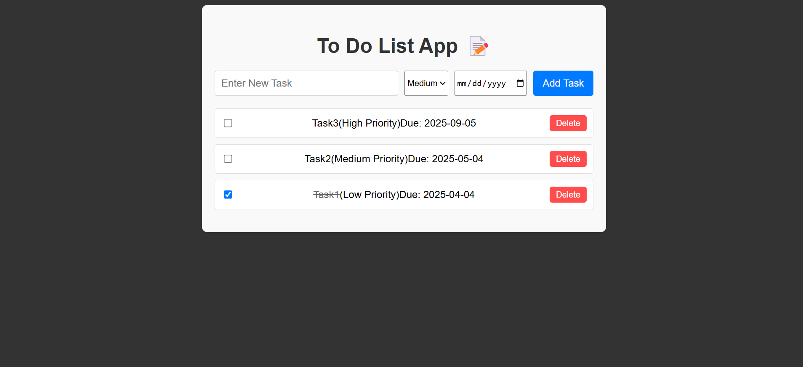

# To-Do-List-Project
Here’s a simple yet well-structured **README.md** for your GitHub repository:  

---  

### 📝 **To-Do List App**  

A simple and interactive **To-Do List App** built using **React**. This app allows users to manage their daily tasks efficiently with features like **task editing, status tracking (checkbox), task prioritization, and due dates**.  

---  

## 🚀 **Features**  
✅ Add new tasks with priority selection (🔥 High, ⚡ Medium, 🌱 Low)  
✅ Mark tasks as completed (adds a line-through effect)  
✅ Edit task names easily  
✅ Delete tasks when no longer needed  
✅ Due dates for better task management  

---  

## 🛠 **Technologies Used**  
- **React** (for building the UI)  
- **CSS** (for styling)  

---  

## 📷 **Preview**  


---  

## 📥 **Installation & Setup**  
1. Clone this repository:  
   ```sh
   git clone https://github.com/jocalvinshua/To-Do-List-Project.git
   ```
2. Navigate to the project folder:  
   ```sh
   cd To-Do-List-Project
   ```
3. Install dependencies:  
   ```sh
   npm install
   ```
4. Start the app:  
   ```sh
   npm start
   ```

---   

## 📬 Contact
For any questions or feedback, feel free to [calvinjoshua37@gmail.com](mailto:calvinjoshua37@gmail.com) 🚀.

---

Let me know if you want any modifications! 😊
